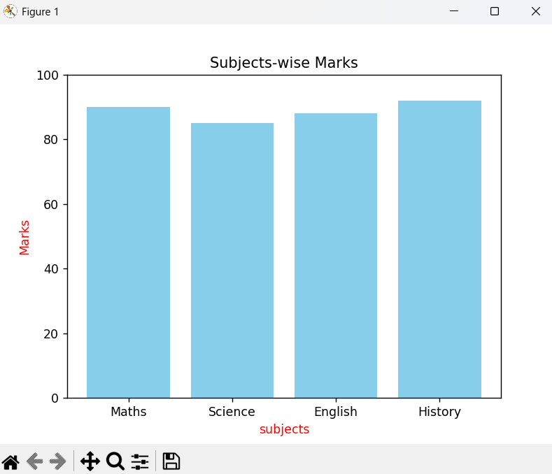
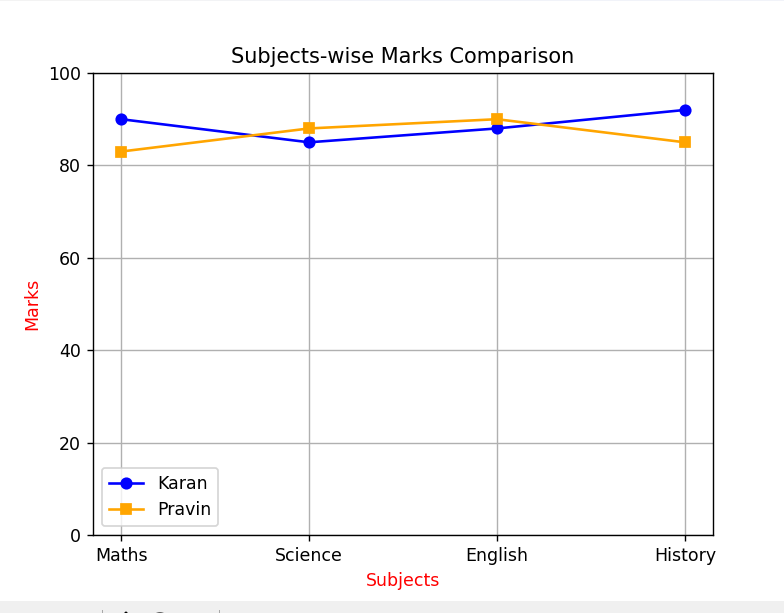

# Python AI & Data Analysis Learning Journey

This repository is a structured day-wise journal of my learning path in Python, Data Analysis, and Machine Learning foundations. Each day builds upon real-world developer practices using Python, NumPy, and Pandas. The focus is to gain not just syntax knowledge but also practical understanding useful for future AI and ML work.

---

## Index

- [Day 1: Python Basics](#day-1-python-basics)
- [Day 2: NumPy & Pandas Introduction](#day-2-numpy--pandas-introduction)
- [Day 3: Real-World Student Data Analysis](#day-3-real-world-student-data-analysis)
- [Day 4: Missing Data Handling & Data Cleaning](#day-4-missing-data-handling--data-cleaning)
- [Day 5: Data Visualization](#day-5-data-visualization)
- [About Me](#about-me)
- [License](#license)

---

## Day 1: Python Basics

### ✅ Topics Covered
- Variables, user input
- Defining and using functions
- Conditional statements (if/else)
- Loops, even/odd logic
- Lists (`append()`) and dictionaries

### 🔍 Why This Matters
Understanding Python fundamentals is the core of any software or data-related role. This day built the foundation for all logic and syntax that I use in future tasks.

---

## Day 2: NumPy & Pandas Introduction

### ✅ Topics Covered
- Creating NumPy arrays
- Array operations: `sum`, `mean`, `sqrt`, `min`, `max`
- Creating a Pandas DataFrame from dictionary
- Column access and filtering (`df['marks'] > 80`)

---

## Day 3: Real-World Student Data Analysis

### ✅ Topics Covered
- Creating a real DataFrame for student marks
- Calculating `total` and `average` across multiple subjects
- Conditional grading (A, B, C, etc.)
- Filtering students based on performance

---

## Day 4: Missing Data Handling & Data Cleaning

### ✅ Topics Covered
- Handling NaN values using `fillna()`
- Column-wise mean replacement
- Dynamic cleaning using loops

---

## Day 5: Data Visualization

### 1. Bar Plot (Vertical Bar Chart)

A bar plot or bar chart is a graph that represents **categories of data** with rectangular bars. The **height of each bar** corresponds to the value it represents. It is used to compare things between different groups.

We use the `bar()` method from `matplotlib.pyplot` to create a vertical bar chart.

#### Output:

---

### 2. Line Plot (Marks Comparison)

A line chart is used to represent **data that changes** or to **compare multiple data series**. Here, we compared the marks of two students.

We used the `plot()` method with markers, colors, labels, and grid.

#### Output:

---

## About Me

**Karan Bharvadiya**  
Final Year CSE Student | GEC Rajkot  
Learning Python, Data Science, and AI fundamentals.  
Also experienced with Laravel (PHP), Tailwind CSS, and Web Development.

GitHub: [https://github.com/KaranBharvadiya1](https://github.com/KaranBharvadiya1)

---

## License

This repository is part of my personal learning journey.  
You may use the structure or content for self-learning or reference.  
No commercial redistribution allowed.
